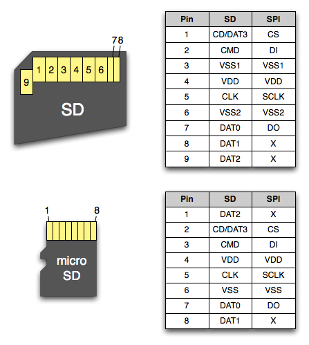

## SD Card Pinout

### SD Card

| Pin |   SD    | SPI  |
| :-- | :------ | :--- |
|  1  | CD/DAT3 | CS   |
|  2  | CMD     | DI   |
|  3  | VSS1    | VSS1 |
|  4  | VDD     | VDD  |
|  5  | CLK     | SCLK |
|  6  | VSS2    | VSS2 |
|  7  | DAT0    | DO   |
|  8  | DAT1    | X    |
|  9  | DAT2    | X    |

### Micro SD Card

| Pin |   SD    | SPI  |
| :-- | :------ | :--- |
|  1  | DAT2    | X    |
|  2  | CD/DAT3 | CS   |
|  3  | CMD     | DI   |
|  4  | VDD     | VDD  |
|  5  | CLK     | SCLK |
|  6  | VSS     | VSS  |
|  7  | DAT0    | DO   |
|  8  | DAT1    | X    |          

- **CS** --> Chip Select
- **DI** (Data In) --> MOSI (Master Out, Slave Input)
- **VSS** --> Ground
- **VDD** --> Power
- **CLK** (Clock) --> SCLK (Serial Clock)
- **DO** (Data Out) --> MISO (Master Input, Slave Output)

